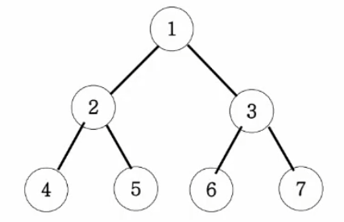

# 너비 우선 탐색 (BFS)

> 루트 노드(혹은 다른 임의의 노드)에서 시작해서 인접한 노드를 먼저 탐색하는 방법
> 레벨 탐색이라고도 함



* 너비 우선 탐색은 자료구조 큐(Queue)를 사용한다

```java
import java.io.*;
import java.util.*;

/* 인접 리스트를 이용한 방향성 있는 그래프 클래스 */
class Graph {
  private int V; // 노드의 개수
  private LinkedList<Integer> adj[]; // 인접 리스트

  /** 생성자 */
  Graph(int v) {
    V = v;
    adj = new LinkedList[v];
    for (int i=0; i<v; ++i) // 인접 리스트 초기화
      adj[i] = new LinkedList();
  }

  /** 노드를 연결 v->w */
  void addEdge(int v, int w) { adj[v].add(w); }

  /** s를 시작 노드으로 한 BFS로 탐색하면서 탐색한 노드들을 출력 */
  void BFS(int s) {
    // 노드의 방문 여부 판단 (초깃값: false)
    boolean visited[] = new boolean[V];
    // BFS 구현을 위한 큐(Queue) 생성
    LinkedList<Integer> queue = new LinkedList<Integer>();

    // 현재 노드를 방문한 것으로 표시하고 큐에 삽입(enqueue)
    visited[s] = true;
    queue.add(s);

    // 큐(Queue)가 빌 때까지 반복
    while (queue.size() != 0) {
      // 방문한 노드를 큐에서 추출(dequeue)하고 값을 출력
      s = queue.poll();
      System.out.print(s + " ");

      // 방문한 노드와 인접한 모든 노드를 가져온다.
      Iterator<Integer> i = adj[s].listIterator();
      while (i.hasNext()) {
        int n = i.next();
        // 방문하지 않은 노드면 방문한 것으로 표시하고 큐에 삽입(enqueue)
        if (!visited[n]) {
          visited[n] = true;
          queue.add(n);
        }
      }
    }
  }
}
```