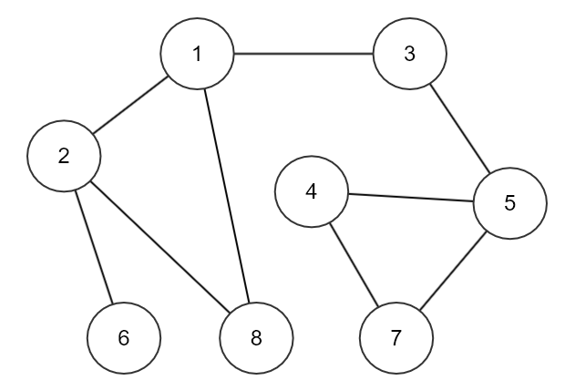

# 깊이 우선 탐색 (DFS)

> 연결된 노드를 따라서 계속 방문을 한 후 더 이상 연결된 노드들이 없을 때
> 그 전 노드로 되돌아가고 다시 연결된 노드를 따라 탐색하는 알고리즘


```java
int[][] graph = {{2,3,8}, {1,6,8}, {1,5}, {5,7}, {3,4,7}, {2}, {4,5}, {1,2}};
```

1. 1번 노드 방문처리 후 출력 (탐색 순서 : 1)
2. 1번 노드에 인접한 노드 2번, 3번, 8번 중 하나를 방문해야 하는데 오름차순으로 방문하기로 가정하겠습니다.
3. 2번 노드 방문처리 후 출력 (탐색 순서 : 1 -> 2)
4. 2번 노드에 인접한 노드 6번, 8번 중 오름차순 기준이니까 6번 노드로 가겠습니다.
5. 6번 노드 방문처리 후 출력 (탐색 순서 : 1 -> 2 -> 6)
6. 6번 노드에 인접한 노드는 2번 노드뿐인데 이미 방문을 하였으므로 더 이상 방문처리는 하지 않고 6번 노드를 호출한 노드(부모 노드)로 다시 돌아갑니다. (여기서는 2번 노드가 됩니다)
7. 2번 노드에 인접한 노드 중 8번 노드가 남아있으므로 8번 노드로 이동합니다.
8. 8번 노드 방문처리 후 출력 (탐색 순서 : 1 -> 2 -> 6 -> 8)
9. 8번 노드에 인접한 노드는 1번과 2번 노드인데 둘 다 모두 방문처리가 되어있으므로 더 이상 방문은 하지 않고 8번을 호출한 노드(부모 노드)인 2번 노드로 돌아갑니다.
10. 2번 노드에 인접한 노드(자식 노드) 6번, 8번이 모두 방문 처리된 상태이므로 2번을 호출한 노드(부모 노드)인 1번 노드로 돌아갑니다.
11. 이제 1번 노드에 인접한 노드 중 방문하지 않은 노드 3번으로 이동합니다.
12. 3번 노드 방문처리 후 출력 (탐색 순서 : 1 -> 2 -> 6 -> 8 -> 3)
13. 3번 노드에 연결된 노드는 5번 노드뿐이므로 5번 노드 방문 처리 후 출력 (탐색 순서 : 1 -> 2 -> 6 -> 8 -> 3 -> 5)
14. 5번 노드에 연결된 노드 4번, 7번 중 오름차순 기준이니까 4번 먼저 방문처리 후 출력
15. 마지막으로 남은 7번 노드 방문 처리 후 출력하면 더 이상 방문할 노드가 없으므로 종료됩니다.
    
탐색 순서(재귀) : 1 -> 2 -> 6 -> 8 -> 3 -> 5 -> 4 -> 7
